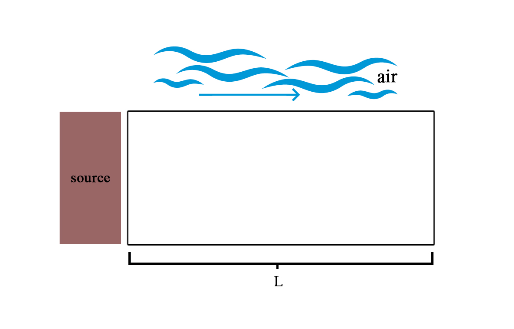

# Air Pollution Simulation
[Latest Release](https://github.com/will004/air-pollution-skripsi/releases/latest)

This program is created to simulate air pollution using 1D advection-diffusion equation with Forward Time Backward Space Central Space numerical scheme. Backward difference method is applied to first derivative of space-axis and Central difference method is applied to second derivative of space-axis.

Illustration of simulation:

<p align="center">
  
</p>


The source of the pollutant is located at 0 cm.
The wind inside the space will move from left to right (position 0 to the far most position of space).
The length of the space is represented by L.

## Run using Python
```
pip install -r requirements.txt
```

then

```
python main.py
```


## Run without Python
If you want to use it without `python`, you can download the app for [MacOS version](https://github.com/will004/air-pollution-skripsi/releases/latest/download/air.pollution.simulation.app.zip) or for [Windows 10 version](https://github.com/will004/air-pollution-skripsi/releases/latest/download/air.pollution.simulation.exe)
